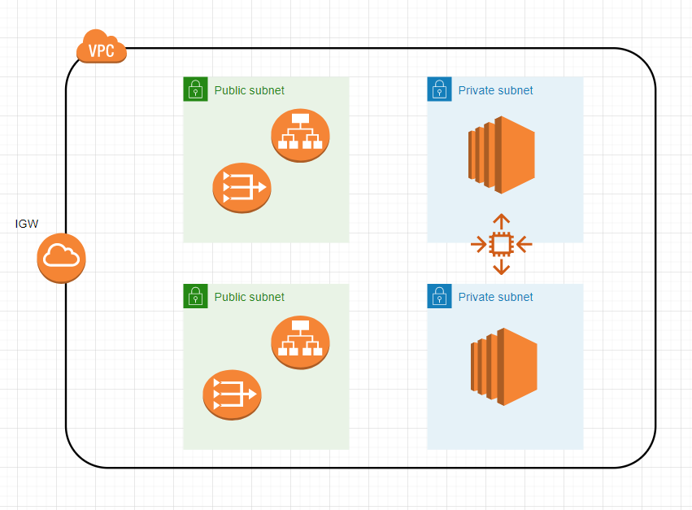
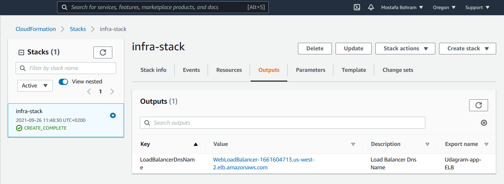
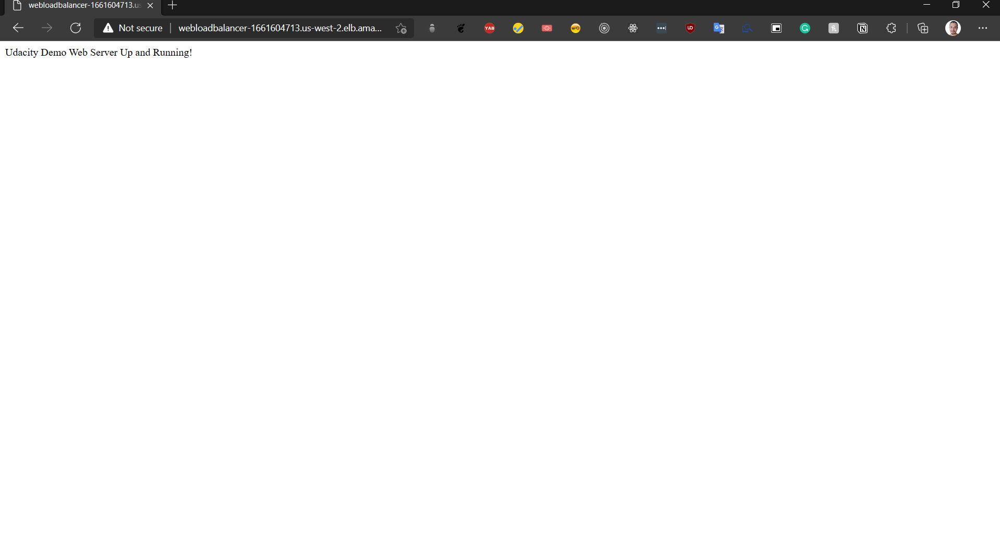

## Udagram High-Available Application in AWS automated by Cloudformation service

This is an Infrastructre as a Code using Cloudformation service in AWS, to provision an infrastructure for Udagram app in AWS

### Scripts

Shell scripts are available in ```scripts``` folder to create, describe and update the stack


## Architecture Diagram


## Screenshot from Cloudformation dashboard (ALB custom generated DNS URL)


## Screenshot of the server response to the URL


### Generated URL of the load balancer is: http://WebLoadBalancer-1661604713.us-west-2.elb.amazonaws.com
